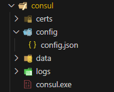
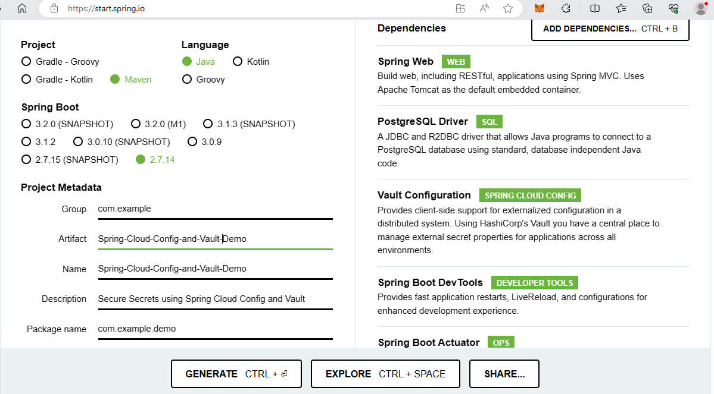
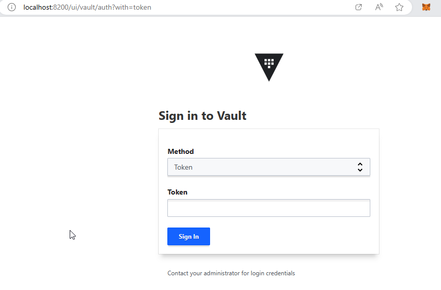
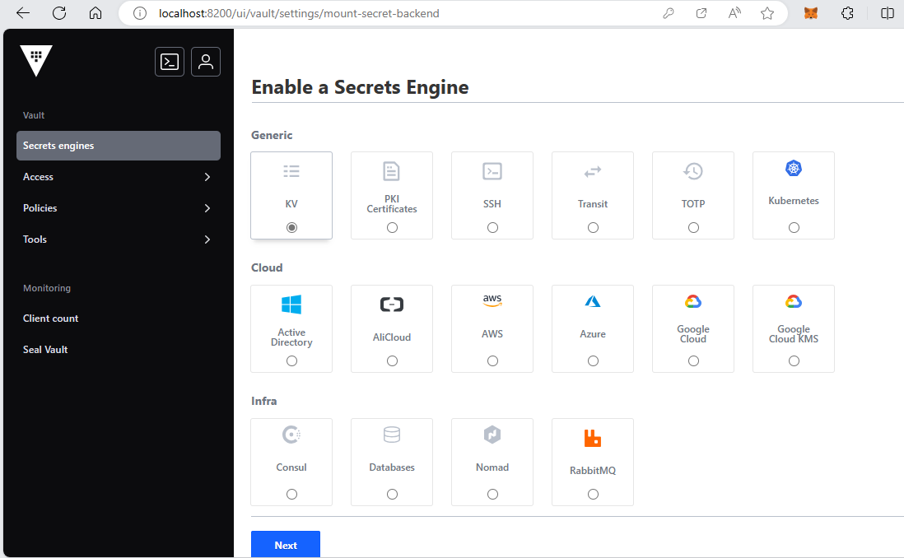
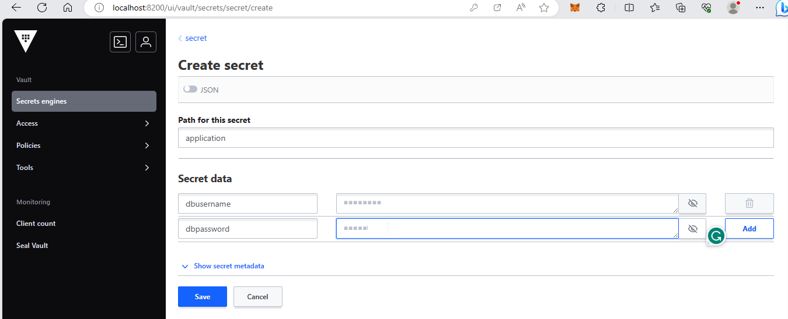

# Spring Boot, Spring Cloud Config, Postgres, Hashicorp Vault  and Hashicorp Consul  Demo


**Prerequisites**
- Softwares needs to be installed on your machine 
    - Hashicorp Consul
    - Hashicorp Vault
    - Postgres
    - Java 11
    - Maven
  
- Downloads
  - Hashicorp Vault  
  https://developer.hashicorp.com/vault/downloads
  - Hashicorp Consul  
    https://developer.hashicorp.com/consul/downloads
  - Postgres  
    https://www.postgresql.org/download/  
  - Java 11  
    https://www.oracle.com/in/java/technologies/javase/jdk11-archive-downloads.html
  - Maven  
    https://maven.apache.org/download.cgi

Install Vault with Consul storage please refer the below link :  
https://developer.hashicorp.com/vault/tutorials/day-one-consul/deployment-guide

- Create folder consul and place the binary or executable file inside, and **set the path in the environment variable**.   


config.json
```
  {
    "server": true,
    "ui": true,
    "bootstrap": true,
    "node_name": "Consul Node",
    "bind_addr": "127.0.0.1",
    "data_dir": "./data",
    "log_level": "INFO",
    "log_file": "./logs/consul.log",
    "datacenter":"MyDatacenter",
    "encrypt": "X06J47090WiximX1LvgAzJt48ZlVu7SxfqZTjqnsMKU=",
    "start_join": [
      "localhost"
    ],
    "acl": {
      "enabled": true,
      "default_policy": "deny",
      "down_policy": "extend-cache",
      "enable_token_persistence": true
    }
  }
```


#### Start Consul with server release mode
```
consul.exe agent -server -bootstrap -config-file="config.json"
```

Note : You can also install as windows service using below command
```
sc.exe create "Consul" binPath= "Consul.exe agent -config-dir=.\\config" start= auto
```

refer this article https://blog.opstree.com/2021/09/21/learn-how-to-control-consul-resources-using-acl/

```
consul acl bootstrap
```

**Bootstrap output**

```
AccessorID:       cdd63c61-d3cc-058a-e7a0-eedb601b7ce1
SecretID:         4b485678-f4f4-5e87-064e-b02f19e76de6
Description:      Bootstrap Token (Global Management)
Local:            false
Create Time:      2023-08-20 00:25:31.6810907 +0530 IST
Policies:
   00000000-0000-0000-0000-000000000001 - global-management

```


#### Create a Vault service ACL token
vault-service-policy.hcl
```
service "vault" { 
    policy = "write" 
}
key_prefix "vault/" { 
    policy = "write" 
}
agent_prefix "" { 
    policy = "read" 
}
session_prefix "" { 
    policy = "write" 
}
```

Create the ACL policy on the Consul cluster using a management token:


```
consul acl policy create -token 4b485678-f4f4-5e87-064e-b02f19e76de6 -name vault-service -rules @vault-service-policy.hcl
```

Create an ACL token using that policy:
```
consul acl token create -description "Vault Service Token" -policy-name vault-service
```

Open the Vault UI http://localhost:8500 using token 4b485678-f4f4-5e87-064e-b02f19e76de6

- Create folder vault and place the binary or executable file inside, and **set the path in the environment variable**.


vault.hcl

```
ui = true

# mlock                     = true
# disable_mlock             = true

##############################################################
##                   File storage                          #
##############################################################
## If you want to configure file system as storage use this

# storage "file" {
# path = "/opt/vault/data"
# }

##############################################################
##                   Consul storage                          #
##############################################################

storage "consul" {
    address                 = "http://localhost:8500"
    path                    = "vault/"
    token                   = "4b485678-f4f4-5e87-064e-b02f19e76de6"      # SecretID
}

cluster_addr                = "http://localhost:8201"
api_addr                    = "http://localhost:8200"

##############################################################
##                  HTTP listener                           #
##############################################################

listener "tcp" {
  address                   = "0.0.0.0:8200"
  tls_disable               = 1  
}

##############################################################
#                   HTTPS listener                          #
##############################################################

# listener "tcp" {
#   address                 = "localhost:8200"
#   tls_cert_file           = "./kirancompany.com-2023-08-19-175953.cer"
#   tls_key_file            = "./kirancompany.com-2023-08-19-175953.pkey"
# }

# telemetry {
#   statsite_address = "127.0.0.1:8125"
#   disable_hostname = true
# }

```
#### Start Vault
```
vault server -config=".\vault.hcl"
```
Open the Vault UI http://localhost:8200/ui

and unseal 

### Create Spring Boot Application using Spring Initializr
https://start.spring.io/

**Project**: Maven
**Language**: Java
**Spring Boot**: 2.7.14

Project Metadata Group: com.example
**Artifact**: Spring-Cloud-Config-and-Vault-Demo
**Name**: Spring-Cloud-Config-and-Vault-Demo
**Description**: Secure Secrets using Spring Cloud Config and Vault
**Package name**: com.example.demo

Packaging: Jar
Java: 11

**Dependencies**  
- Spring Web  
- Spring Boot Dev Tools  
- Spring Boot Actuator  
- PostgreSQL Driver  
- Vault Configuration  
- Cloud Bootstrap - *This is important*  
- Lombok  

Click on GENERATE to create Spring Boot Application as shown in the below image:



Login Vault using root token



Click on the enable new engine and select KV




Provide any path name and click on **Enable Engine** button


To create new secret click on the **Create secret +** button



After provided the secret data click on **Save** button

## ***That's it, your are done with Vault!!***

Now create Spring boot application and communicate with backend postgres.

Also create bootstrap.yml file to fetch the configuration at the time of booting application.
```
spring:
  application:
    name: javainuseapp
  cloud:
    vault:
      host: localhost
      port: 8200
      scheme: http
      token: hvs.OoYTWLHCJDAfEortz7ZroWS2
```

Your application.properties looks like this.

```
spring.datasource.driver-class-name=org.postgresql.Driver
spring.datasource.url=jdbc:postgresql://localhost:5432/postgres
spring.datasource.username=${dbusername}
spring.datasource.password=${dbpassword}
spring.sql.init.platform=postgres
spring.sql.init.mode=always
spring.jpa.database-platform=org.hibernate.dialect.PostgreSQLDialect
spring.jpa.hibernate.ddl-auto=update
spring.jpa.show-sql=true
spring.jpa.generate-ddl=false
```